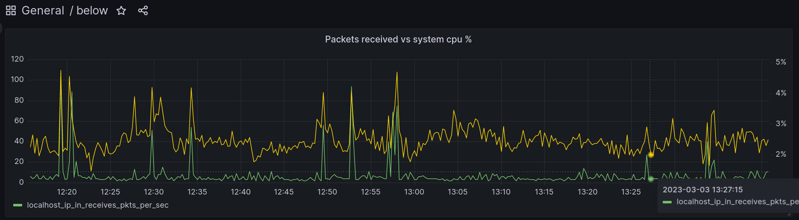

# below-grafana

Scripts / tools to visualize [`below`][0] data in grafana.



### Quickstart

To start [Prometheus][2] and [Grafana][3], run:

```
$ docker compose up -d
```

To import some data from the localhost (snapshot import support is
[coming][4]), run:

```
$ ./import.py host --begin "4h ago" --end "2h ago" --prefix localhost
```

The above commands imports data as keys prefixed with `localhost_`.

To start plotting graphs, visit `http://localhost:3000` for the grafana UI. The
initial login/password is `admin` and `admin`, respectively.

### Details

The basic idea is we run both prometheus and grafana. We use prometheus as an
intermediate time series database so that we don't have to implement a
grafana datasource plugin.

We then export below's data, convert it into [OpenMetrics][1] format, and import
into prometheus.

OpenMetrics conversion is currently done using a script but could in theory be
upstreamed into `below-dump` in the future.


[0]: https://github.com/danobi/below-grafana
[1]: https://github.com/OpenObservability/OpenMetrics/blob/main/specification/OpenMetrics.md
[2]: https://prometheus.io/
[3]: https://grafana.com/
[4]: https://github.com/facebookincubator/below/pull/8182
